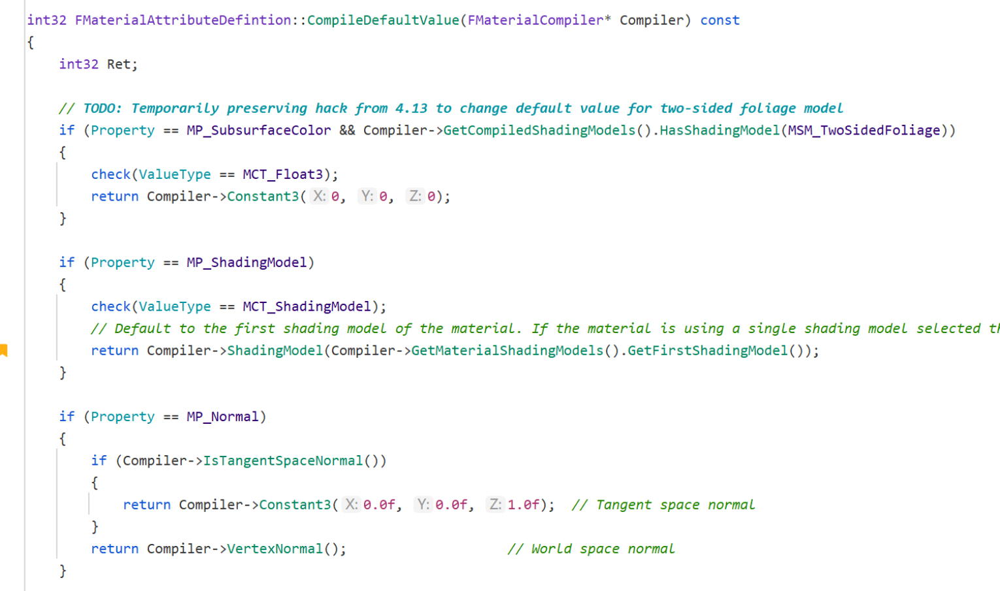
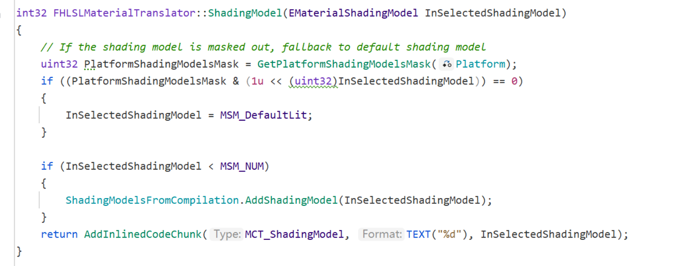
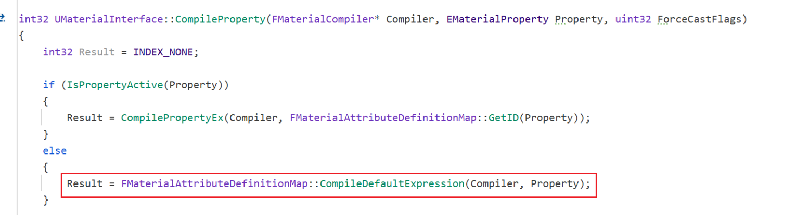
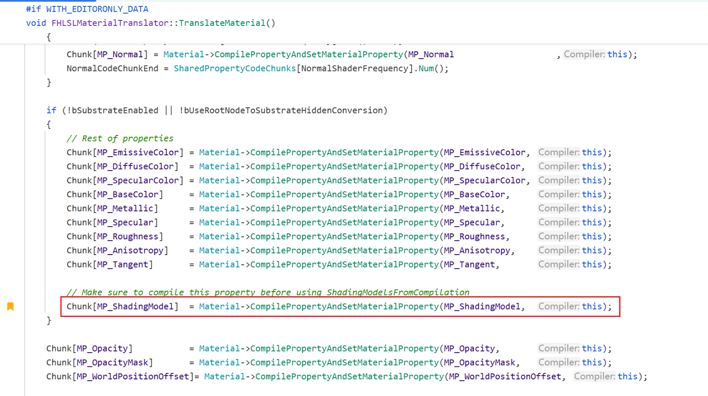
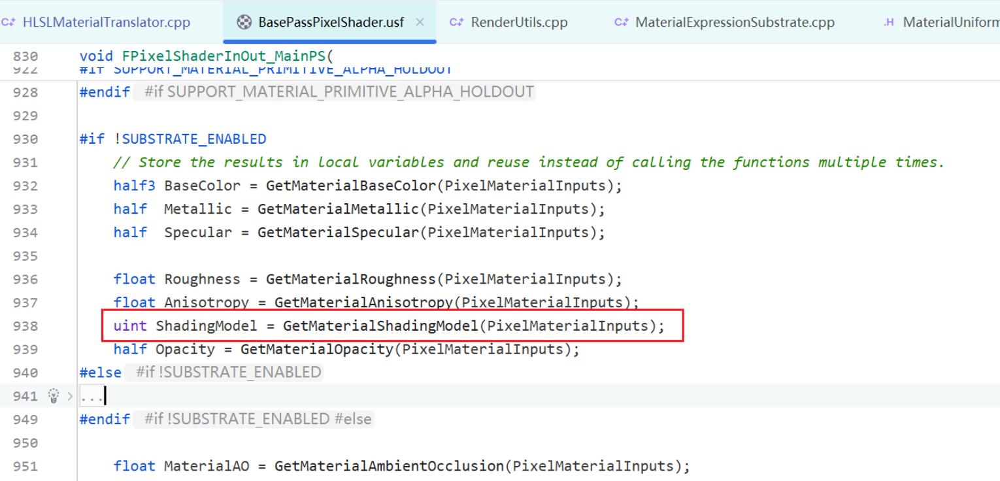
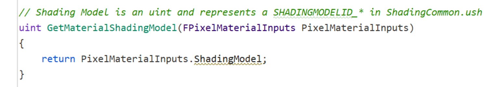
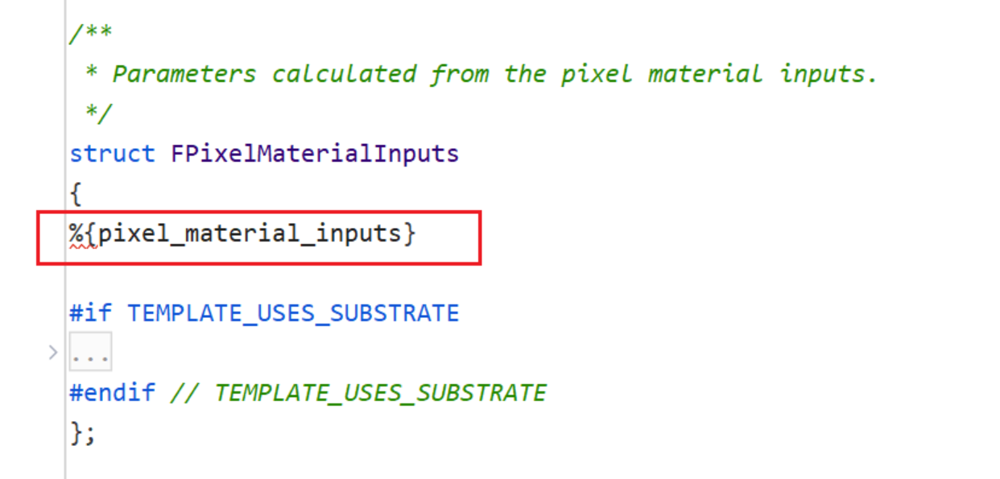
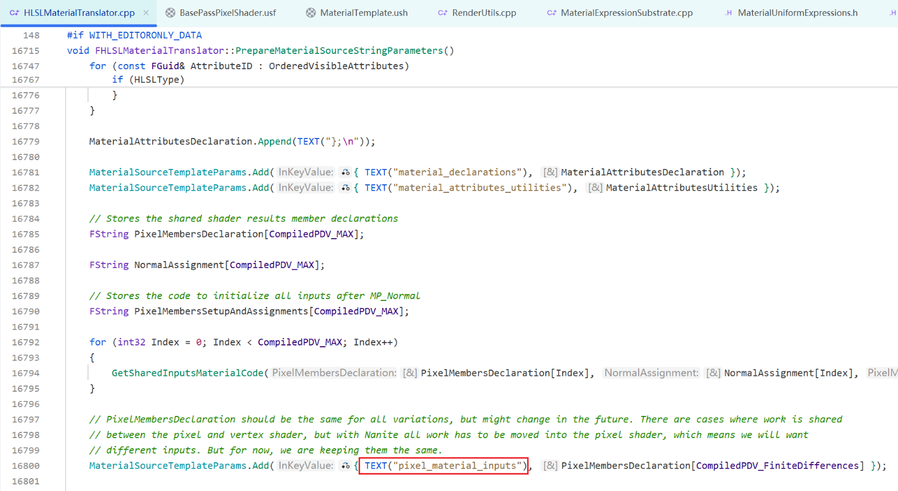
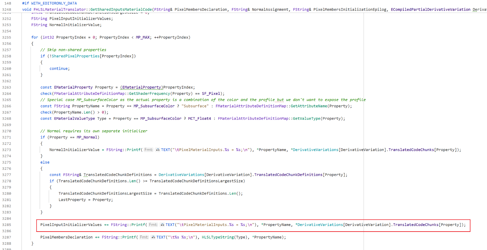
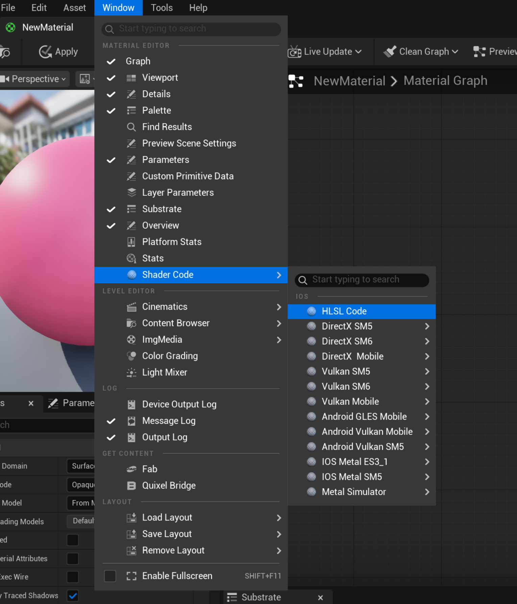

# ShadingModel是如何从材质里设置到最终在Shader中使用的？

ShadingModel 通过在材质中设置后通过Compiler->ShadingModel 写入CodeTrunk

没有使用MSM_FromExpression时，会走else分支

BasePass Shader中获取ShadingModel的地方

ShadingModel的写入是在材质编译生成的代码中的

